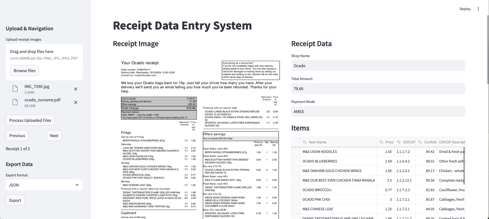

# ScannerAI - Receipt Scanner and Classifier
ScannerAI is a Python application that processes retail receipts using computer vision and AI to extract, classify and analyze receipt data. It features a graphical user interface for viewing and editing receipt information with support for COICOP (Classification of Individual Consumption According to Purchase) code classification.

## Features

- **Receipt Processing**: Extract text and structured data from receipt images and PDFs
- **Item Classification**: Automatically classify items using COICOP codes
- **Interactive GUI**: View, edit, and manage receipt data
- **Multiple OCR Options**: Support for multiple OCR models including Gemini and OpenAI
- **Batch Processing**: Process multiple receipts from a folder
- **Export Options**: Save processed data in JSON or CSV formats
- **Progress Tracking**: Visual progress tracking for batch operations

## User Interface


## Installation

**1. Clone the repository**
``` bash
git clone https://github.com/yourusername/scannerAI.git
cd scannerAI
```

**2. Set up virtual environment**

You are strongly recommended to install resources into a virtual environment.

``` bash
python -m venv scanner-venv
source scanner-venv/bin/activate # source scanner-venv/Scripts/activate on Windows
python -m pip install --upgrade pip
python -m pip install .
```

> \[!NOTE\] If you intend doing any development work, please install the package as editable and with the `dev` optional dependencies:
>
> ``` bash
> python -m pip install -e ".[dev]"
> ```
>
> Moreover, once you have installed the package, please install the pre-commit hooks. These hooks help us to ensure repository security and a consistent code style.


**3. Install the required dependencies**
``` bash
pip install -r requirements.txt
```


**4. Set up configuration**
Create a configuration file (e.g., `config.txt`) at the folder 'scannerai/_config/' with the following parameters:
   ``` bash
   DEBUG_MODE=False
   ENABLE_PREPROCESSING=False
   SAVE_PROCESSED_IMAGE=False
   ENABLE_PRICE_COUNT=False
   OCR_MODEL=3
   CLASSIFIER_MODEL_PATH=/path/to/your/trained/model
   LABEL_ENCODER_PATH=/path/to/your/label/encoder
   GEMINI_API_KEY_PATH=/path/to/your/gemini/api/key
   OPENAI_API_KEY_PATH=/path/to/your/openai/api/key
   GOOGLE_CREDENTIALS_PATH=/path/to/your/google/credentials
   ```

Rember to update config = Config("/path/to/your/config.txt") in 'scannerai/_config/config.py'
There is an example of 'scannerai_config.txt' for your reference.

## Usage

### Starting the Application

``` bash
streamlit run scripts/lcf_receipt_entry_streamlit.py
```

#### Basic Workflow

1. Click "Open Folder" to select a directory containing receipt images/PDFs
2. Review extracted data and classifications
3. Edit items, prices, or classifications if needed
4. Navigate between receipts using Previous/Next buttons
5. Save processed data as JSON or CSV


#### Features

- **Add Items**: Manually add items to the receipt
- **Edit Items**: Modify item details including name, price, and COICOP code
- **Delete Items**: Remove incorrect or unwanted items
- **Image Preview**: View receipt image with highlighted item locations
- **Batch Processing**: Process multiple receipts with progress tracking
- **Data Export**: Save processed data in JSON or CSV format


### Process a single receipt
Here is an example using Google's Gemini model to take image or pdf as input and output a dictionary of shop name, items and their prices, total amount and payment methods.

```
import json
import os
from scannerai.ocr.lcf_receipt_process_gemini import LCFReceiptProcessGemini

processor = LCFReceiptProcessGemini()
image_pathfile = os.path.join('/path/to/your/image.jpg')
result = processor.process_receipt(image_pathfile)
print(json.dumps(result, indent=2))

```

## Project Structure

- `lcf_receipt_entry_streamlit.py`: Main GUI application using streamlit
- `lcf_receipt_process_gemini.py`: Receipt processing using Gemini Vision API
- `lcf_receipt_process_gpt4vision.py`: Receipt processing using OpenAI model gpt-4o-mini
- `lcf_receipt_process_openai.py`: Receipt processing using Tesseract to extract string from an image and then input to OpenAI model gpt-3.5-turbo
- `lcf_classify.py`: COICOP classification implementation
- `scanner_utils.py`: Utility functions
- `config.py`: Configuration management

## Dependencies

See `requirements.txt` for detailed dependencies.

## Configuration

The application uses a configuration file with the following settings:

- `DEBUG_MODE`: Enable/disable debug logging
- `ENABLE_PREPROCESSING`: Enable/disable image preprocessing (not implemented at this moment)
- `SAVE_PROCESSED_IMAGE`: Save processed images
- `ENABLE_PRICE_COUNT`: Enable token counting for API pricing
- `OCR_MODEL`: Select OCR model
- `CLASSIFIER_MODEL_PATH`: Path to trained classification model
- `LABEL_ENCODER_PATH`: Path to label encoder
- `GEMINI_API_KEY_PATH`: Path to Gemini API key file
- `OPENAI_API_KEY_PATH`: Path to OpenAI API key file
- `GOOGLE_CREDENTIALS_PATH`: Path to Google Cloud credentials

## API Keys

The application requires API keys for OCR services:
- Gemini API key (if Google's Gemini is selected as OCR_MODEL)
- OpenAI API key (optional if OpenAI API is selected as OCR_MODEL)
- Google Cloud credentials (for Gemini)

Store API keys in separate files and update paths in the configuration.

### Pre-commit actions

This repository contains a configuration of pre-commit hooks. These are language agnostic and focussed on repository security (such as detection of passwords and API keys). If approaching this project as a developer, you are encouraged to install and enable `pre-commits` by running the following in your shell: 1. Install `pre-commit`:

````
  ```
  pip install pre-commit
  ```
````

2.  Enable `pre-commit`:

    ```
    pre-commit install
    ```

    Once pre-commits are activated, whenever you commit to this repository a series of checks will be executed. The pre-commits include checking for security keys, large files and unresolved merge conflict headers. The use of active pre-commits are highly encouraged and the given hooks can be expanded with Python or R specific hooks that can automate the code style and linting. For example, the `flake8` and `black` hooks are useful for maintaining consistent Python code formatting.

**NOTE:** Pre-commit hooks execute Python, so it expects a working Python build.


# Data Science Campus

At the [Data Science Campus](https://datasciencecampus.ons.gov.uk/about-us/) we apply data science, and build skills, for public good across the UK and internationally. Get in touch with the Campus at [datasciencecampus\@ons.gov.uk](datasciencecampus@ons.gov.uk).

# License

<!-- Unless stated otherwise, the codebase is released under [the MIT Licence][mit]. -->

The code, unless otherwise stated, is released under [the MIT Licence](LICENCE).

The documentation for this work is subject to [© Crown copyright](http://www.nationalarchives.gov.uk/information-management/re-using-public-sector-information/uk-government-licensing-framework/crown-copyright/) and is available under the terms of the [Open Government 3.0](http://www.nationalarchives.gov.uk/doc/open-government-licence/version/3/) licence.
